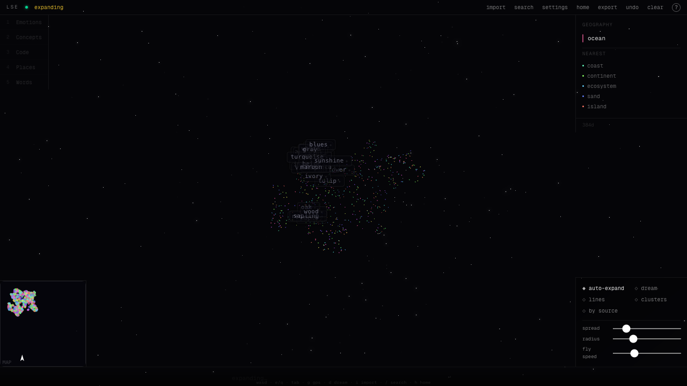

<div align="center">

# 🌌 Latent Space Explorer

### Fly through a 3D map of meaning.

Type any concept and watch it drop into space — right next to the ideas an AI model thinks are similar. The closer two points sit, the closer their meaning. No install, no API key, no sign-up. It runs entirely in your browser.



<p>
  
  
  
  
  
</p>

</div>

---

## ✨ What is this?

Language models turn words into long lists of numbers — **embeddings** — where similar meanings end up close together in a high-dimensional space. That space is impossible to picture… so this project flattens it down to 3D and lets you **fly around inside it**.

- **Type a concept** → it gets embedded and lands near things that mean something similar.
- **Get close to a point** → related ideas bloom around it, so the map keeps unfolding as you wander.
- **Watch ideas cluster** → emotions drift one way, animals another, abstract concepts somewhere else entirely.

It loads pre-filled with a rich cloud of ~600 everyday concepts, so there's something to explore the instant you open it.

## 🚀 Quick start

No keys, no setup — just clone and run:

```bash
git clone https://github.com/james-julius/latent-space-explorer.git
cd latent-space-explorer
npm install
npm run dev
```

Open **http://localhost:3000** and start flying. The embedding model (~30 MB) downloads once on first load and is cached in your browser forever after.

## 🧠 How it works

```
your text ─▶ embedding (bge-small, in-browser) ─▶ 3D projection (UMAP) ─▶ a glowing point
```

- **Embeddings run on your device.** [`bge-small-en-v1.5`](https://huggingface.co/Xenova/bge-small-en-v1.5) runs locally via [🤗 Transformers.js](https://github.com/huggingface/transformers.js) (WASM/WebGPU). Nothing you type is sent to a server.
- **Pre-seeded scenes load instantly.** A build-time script embeds a curated concept atlas and precomputes its 3D layout, shipped as a small static file — so the cloud renders before the model even finishes loading.
- **Your additions stay in the same space.** New points are placed next to their nearest semantic neighbours, growing the map without rearranging it. Everything you build is saved locally in your browser and can be exported/imported as JSON.

## 🤖 Compare how different models think (optional)

Bring your own API key for **Claude**, **ChatGPT**, or **Gemini** and let each model suggest related concepts as you explore. Switch on **“by source”** colouring to see, in one shared space, *where the models agree and where they diverge* on what relates to what.

Keys are stored only in your browser and sent only to that provider — never anywhere else.

## ⌨️ Controls

| | |
|---|---|
| `W` `A` `S` `D` | move · `E` / `Q` up / down · hold `Shift` to warp |
| drag | look around |
| **click a point** | inspect it + reveal its nearest neighbours |
| `Tab` | jump to the nearest neighbour |
| `F` / `X` | expand the selected point into related concepts |
| `B` | bridge — find the conceptual path between two points |
| `G` | GPS — take a guided tour between two points |
| `[` / `]` | step back / forward through your trail |
| `H` | fly home · `D` | dream mode (auto-wander) |
| `/` | search · `I` | import text or a saved graph · `⌘/Ctrl + Z` undo |
| `1`–`5` | load a themed preset |

## 🛠️ Tech stack

- **[Next.js 16](https://nextjs.org)** (App Router, Turbopack) + **React 19** + **TypeScript**
- **[Three.js](https://threejs.org)** via **[@react-three/fiber](https://github.com/pmndrs/react-three-fiber)** & **drei** for the 3D scene
- **[Transformers.js](https://github.com/huggingface/transformers.js)** for in-browser embeddings
- **[UMAP](https://github.com/PAIR-code/umap-js)** for dimensionality reduction
- **Zustand**-light state, Tailwind CSS

## 🌱 Regenerate the seed scene

The pre-seeded concept atlas is generated at build time. To edit the concepts or build your own scene, tweak [`scripts/seed-topics.mjs`](scripts/seed-topics.mjs) and run:

```bash
npm run seed
```

This embeds every term, runs a deterministic UMAP projection, quantizes the vectors, and writes the static scene to `public/scenes/`.

---

<div align="center">
<sub>Built to make the invisible geometry of meaning something you can actually fly through. ✦</sub>
</div>
